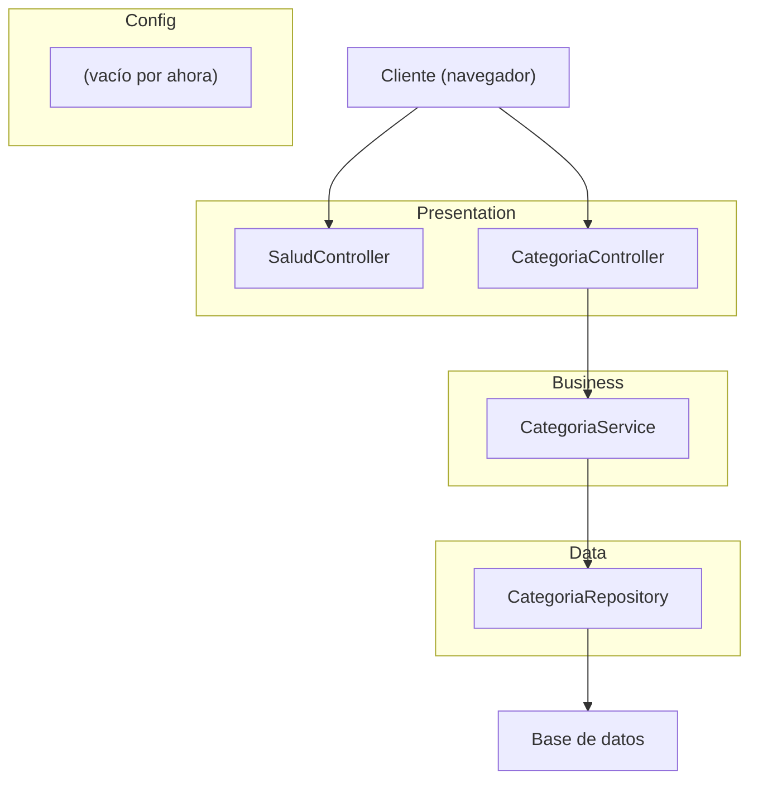
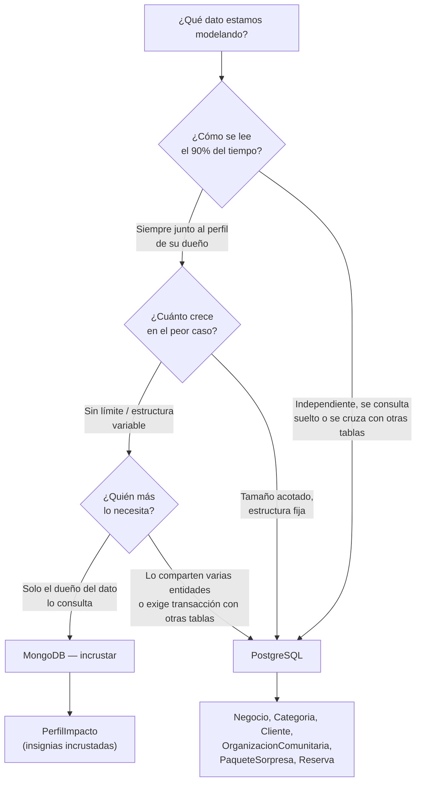
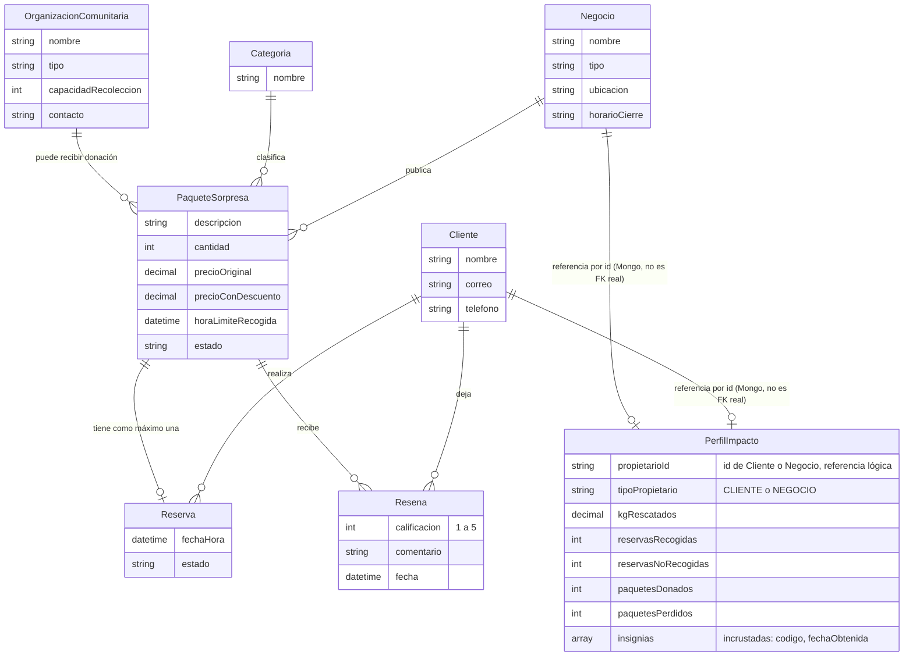

# Diagrama de Arquitectura

Laboratorio 1 y 2 · Savora

## Capas del sistema

Las dependencias van en una sola dirección: **presentation → business → data**. Un controlador puede llamar a un servicio; un servicio no conoce la capa de presentación.

`PerfilImpactoController`, `PerfilImpactoService` y `PerfilImpactoRepository` siguen las mismas capas que `CategoriaController`/`CategoriaService`/`CategoriaRepository`, solo que `PerfilImpactoRepository` es un `MongoRepository` en vez de una implementación manual.

## Decisión: PostgreSQL vs MongoDB

Se aplican las 3 preguntas de diseño de la Sesión 4 para decidir en qué base vive cada dato:

**Resultado:**

| Aspecto | Dónde vive | Por qué |
|---|---|---|
| Negocio, Cliente, Categoria, OrganizacionComunitaria | PostgreSQL | Datos maestros, se cruzan en joins, estructura fija |
| PaqueteSorpresa, Reserva | PostgreSQL | Exigen consistencia transaccional: stock, estados, FK, UNIQUE |
| PerfilImpacto (kg rescatados, ratios, insignias) | MongoDB | Se lee siempre completo junto a su dueño, crece sin límite, sin joins ni transacciones |
| Resena (calificación, comentario) | MongoDB | Se lee siempre junto al paquete/negocio, estructura variable, sin límite de cantidad |

## Modelo de dominio

### Reglas del dominio

- Correo del cliente único.
- Precio con descuento menor al precio original.
- Máximo N reservas activas por cliente (el límite base sube si el cliente tiene buena reputación en `PerfilImpacto`).
- Un negocio con buen ratio de `paquetesDonados`/`paquetesPerdidos` gana mejor posicionamiento en el catálogo.
- El historial de compras del cliente se obtiene consultando `Reserva` por `clienteId` — no es un campo propio de `Cliente`.