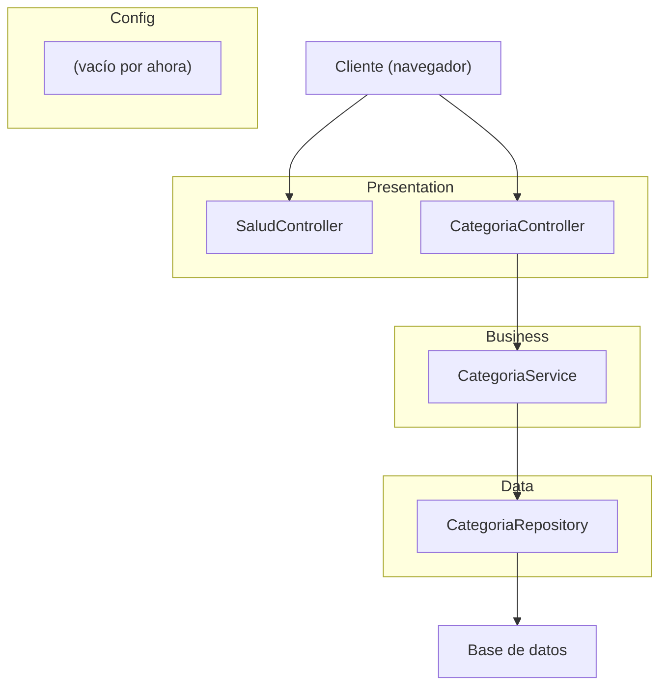
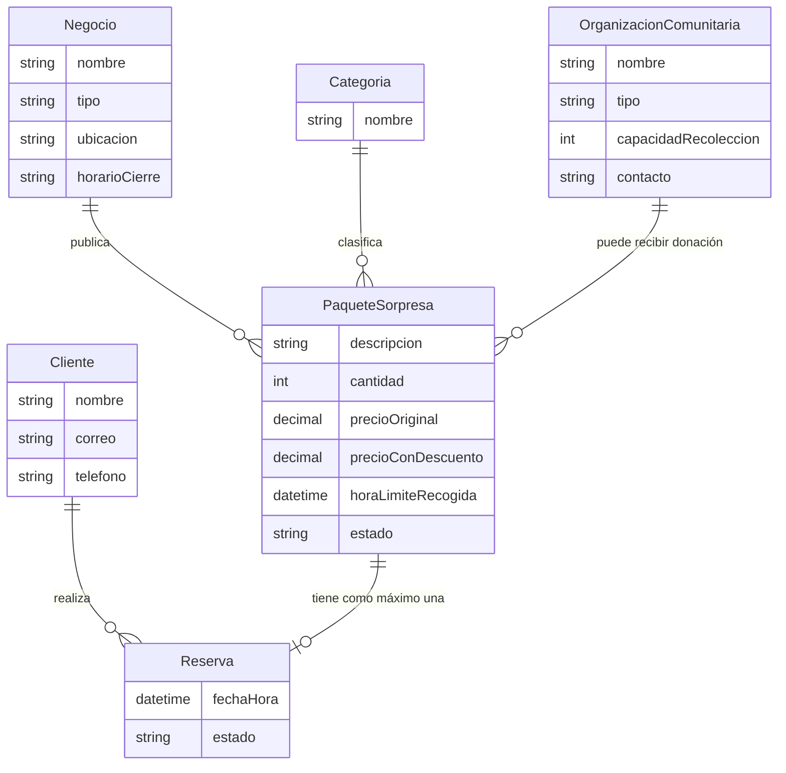

# Diagrama de Arquitectura

Laboratorio 1 · Savora

## Capas del sistema

Las dependencias van en una sola dirección: **presentation → business → data**. Un controlador puede llamar a un servicio; un servicio no conoce la capa de presentación.

## Modelo de dominio

### Reglas del dominio

- Correo del cliente único.
- Precio con descuento menor al precio original.
- Máximo N reservas activas por cliente.
